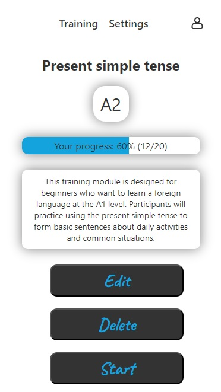
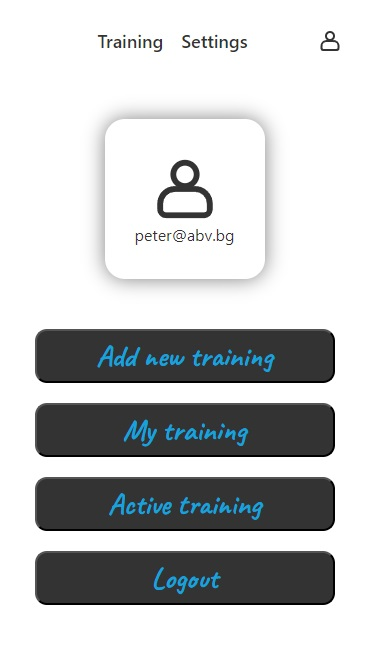
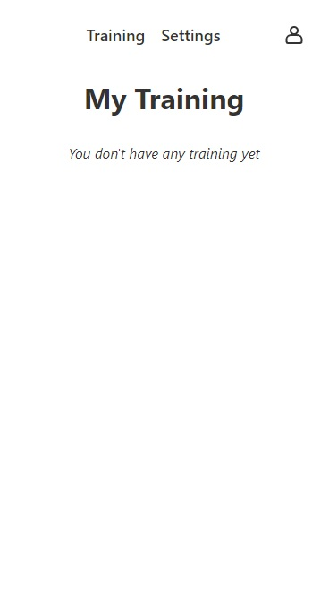

# Vocabulary

**Vocabulary** is an educational React project designed to help users learn foreign languages. The project aims to practice the functionality of React. The use of external libraries is kept to a minimum. The web application provides an interactive way for learners to practice and improve their language skills by generating sentences in the target language.

## Table of Contents

- [Features](#features)
- [Installation](#installation)
- [Usage](#usage)
- [Contacts](#contacts)

## Features

- Generate sentences in the target language for practice.
- View translations of sentences to compare and learn.
- Mark sentences as "learned" to track progress and avoid repetition.
- Customize the application's appearance with different color themes.
- Choose from collections of sentences at different language proficiency levels.
- Add, edit, and delete sentence collections.
- Monitor learning progress within specific collections.

## Technologies Used

- React (v18.2.0)
- React DOM (v18.2.0)
- React Router DOM (v6.23.1)
- Softuni-practice-server (backend)

## Installation

To install and run the project locally:

1. Clone the repository

2. In a new terminal, navigate to the server directory and start the server
   `cd server`
   `node server.js`
3. In a new terminal, navigate to the client directory and install the dependencies:
   `cd client`
   `npm install`

4. In the same directory start the client server

   `npm run dev`

5. Open your browser and navigate to http://localhost:5173 to access the application. **The user interface is designed to be used primarily on mobile devices. It is recommended to test the application in responsive design mode with a resolution of 375x667 (iPhone SE) or on another mobile resolution to ensure optimal user experience.** For testing purposes, you can either register a new account or use the test accounts peter@abv.bg and george@abv.bg with password 123456.

## User interface (Screenshots)

- Welcome page

<kbd></kbd> <kbd>

- Register and login page

</kbd> <kbd></kbd></kbd> <kbd></kbd>

- All training for guest/user

<kbd></kbd></kbd> <kbd></kbd>

- Detais page for guest / user / owner

<kbd></kbd></kbd> <kbd></kbd><kbd></kbd>

- Vocabulary (only for users)

<kbd></kbd></kbd>
<kbd></kbd></kbd><kbd></kbd></kbd>

- User Page / create training / delete training

<kbd></kbd></kbd>
<kbd></kbd></kbd>

- My training / no training / active training

<kbd></kbd></kbd>
<kbd></kbd></kbd><kbd></kbd></kbd>

- Settings (All themes)

<kbd></kbd></kbd>
<kbd></kbd></kbd>
<kbd></kbd></kbd>
<kbd></kbd></kbd>

- Spinner

<kbd></kbd></kbd>

- Notifications

<kbd></kbd></kbd><kbd></kbd></kbd>

## Contacts

For questions or suggestions, please contact me at wladimir.manev@gmail.com.
